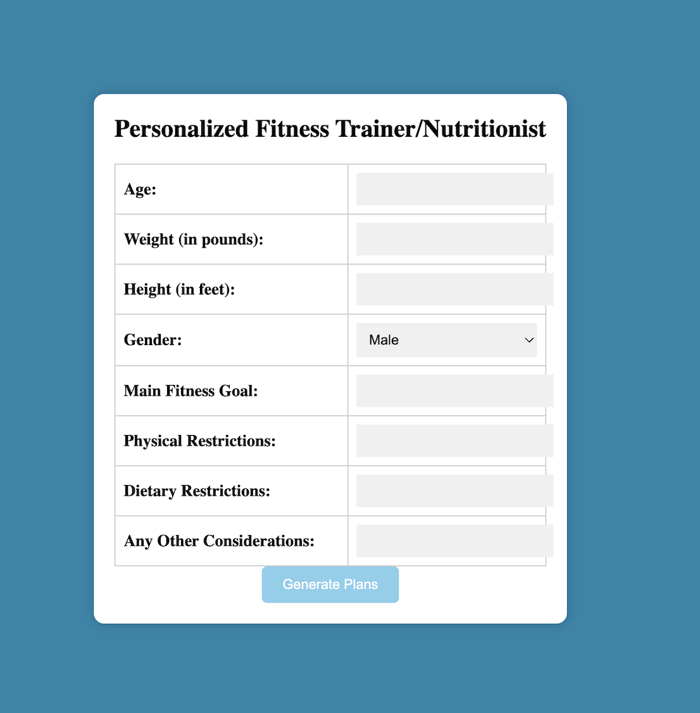
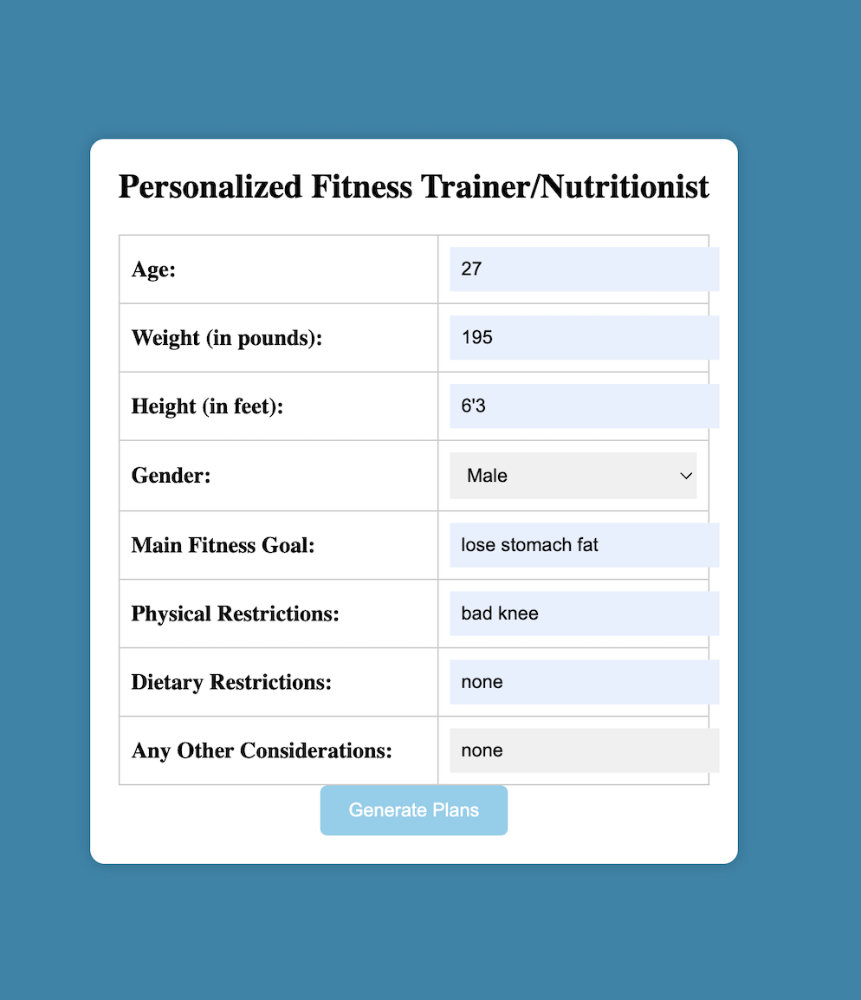
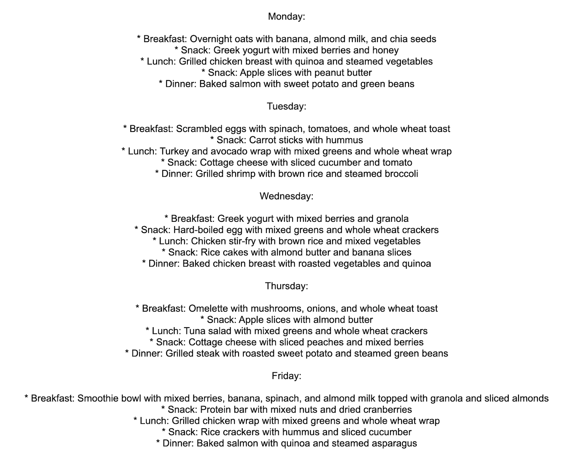

# LLM Fitness Trainer Nutritionist App

Many individuals aspire to achieve their fitness goals. Despite the abundance of information available on the internet, encompassing workout routines and diet plans to fulfill specific objectives (through platforms like Google and YouTube), these vast resources often fail to resonate with an individual's unique circumstances. Consequently, attempting to adhere to these generalized regimens can lead to demotivation. In response, we have developed an app that leverages a replicated API key to interface with the LLaMA (13B weights version) large language model.

The app generates a tailored weekly workout routine, precisely aligned with the distinct requirements of each individual. This personalized approach takes into account a multitude of factors, including gender, age, weight, height, primary fitness objective, physical limitations, dietary preferences, and other pertinent considerations. By utilizing the app, users gain access to a comprehensive solution that not only crafts an exercise plan but also formulates a weekly dietary regimen, propelling them towards their desired fitness milestones.

To provide a visual understanding of the app's functionality, refer to the example images showcasing the user interface as well as a sample output. Our application strives to bridge the gap between generic fitness advice and personalized, actionable strategies. Experience a holistic fitness journey with the LLM Fitness Trainer Nutritionist App.

To run this app on your own, get your own Replicate API key at: https://replicate.com/ and input it in the app.py script for the os.environ['REPLICATE_API_TOKEN'] variable.

  

